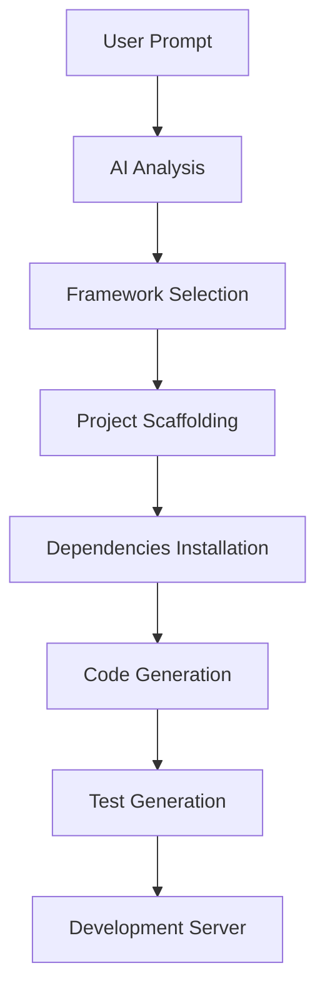

# Bolt.new AI Application Architecture

This document describes the architecture of our multi-AI model development environment, based on bolt.new and inspired by v0.dev. The system enables full-stack application generation from natural language prompts, with in-browser development capabilities and seamless local/remote integration.

## System Overview

The application is a sophisticated development environment that combines:
- Multiple AI model providers for code generation
- WebContainer-based in-browser development
- Multi-framework support (Next.js, Svelte, Remix, React)
- Integrated tooling system
- Local and remote development capabilities

## Core Components

### 1. AI Provider Layer (`src/lib/providers/`)

The AI provider system enables interaction with multiple AI models through a unified interface:

```typescript
interface AIProvider {
  generateStream(messages: Message[], config: AIConfig): Promise<ReadableStream<StreamChunk>>
  generate(messages: Message[], config: AIConfig): Promise<AIResponse>
}
```

Supported Providers:
- OpenAI (GPT-4, GPT-3.5)
- Anthropic (Claude)
- Groq
- HuggingFace
- Mistral
- OpenRouter
- Local LLMs (via Ollama)
- Custom API endpoints

### 2. WebContainer System (`app/lib/webcontainer/`)

Enables in-browser development environment:

```typescript
class WebContainerManager {
  private webcontainer: WebContainer
  
  async boot() {
    this.webcontainer = await WebContainer.boot({
      workdirName: WORK_DIR_NAME,
    })
  }

  async installDependencies() {...}
  async runDev() {...}
  async runTests() {...}
}
```

Features:
- In-browser Node.js runtime
- Full filesystem access
- Terminal emulation
- Package management
- Process management
- Hot reloading

### 3. Tool System (`src/lib/tool-system.ts`)

Extensible tool system for enhanced AI capabilities:

```typescript
interface Tool {
  name: string
  description: string
  parameters: Record<string, unknown>
  execute: (params: Record<string, unknown>) => Promise<unknown>
}
```

Built-in Tools:
1. File System Operations
   - File CRUD operations
   - Directory management
   - File tree navigation

2. Project Management
   - Dependency installation
   - Build process
   - Testing
   - Development server

3. Git Integration
   - Repository management
   - Version control
   - Remote synchronization

4. Code Generation
   - Component scaffolding
   - API routes
   - Database schemas
   - Type generation

### 4. Framework Support

#### Next.js Projects
```typescript
interface NextJSProjectConfig {
  version: string
  typescript: boolean
  tailwind: boolean
  auth: boolean
  database: 'prisma' | 'drizzle' | 'mongoose'
  api: 'rest' | 'graphql' | 'trpc'
}
```

#### Svelte Projects
```typescript
interface SvelteProjectConfig {
  version: string
  typescript: boolean
  adapter: 'auto' | 'static' | 'node' | 'vercel'
  styling: 'tailwind' | 'scss' | 'vanilla'
}
```

#### Remix Projects
```typescript
interface RemixProjectConfig {
  version: string
  typescript: boolean
  deployment: 'vercel' | 'cloudflare' | 'netlify'
  database: 'prisma' | 'sqlite' | 'postgres'
}
```

## Development Workflow

### Project Generation Flow


### Code Generation Pipeline
```typescript
interface CodeGenerationPipeline {
  analyzePrompt(): ProjectRequirements
  selectFramework(): FrameworkConfig
  generateBoilerplate(): void
  generateComponents(): void
  generateTests(): void
  setupDeployment(): void
}
```

## File System Structure

```
project-root/
├── app/                    # Application core
│   ├── lib/               # Core libraries
│   │   ├── .server/      # Server-side code
│   │   └── webcontainer/ # WebContainer integration
│   └── routes/           # API routes
├── src/                   # Source code
│   ├── components/       # UI components
│   ├── hooks/           # React hooks
│   ├── lib/             # Shared libraries
│   │   ├── providers/   # AI providers
│   │   └── tools/      # Tool implementations
│   └── types/          # TypeScript types
└── public/              # Static assets
```

## State Management

Using nanostores for atomic state management:

```typescript
interface ApplicationState {
  webcontainer: WebContainerState
  fileSystem: FileSystemState
  terminal: TerminalState
  aiProvider: AIProviderState
  tools: ToolState
  project: ProjectState
}
```

## External Integrations

### GitHub Integration
```typescript
interface GitHubIntegration {
  createRepository(name: string): Promise<string>
  pushFiles(files: FileMap): Promise<void>
  createPullRequest(branch: string, title: string): Promise<string>
}
```

### Local System Integration
```typescript
interface LocalSystemIntegration {
  downloadFiles(format: 'zip' | 'tar'): Promise<Blob>
  exportToDirectory(path: string): Promise<void>
  syncChanges(direction: 'pull' | 'push'): Promise<void>
}
```

## Security

### API Key Management
- Secure storage in environment variables
- Key rotation support
- Scope limitations
- Environment isolation

### Code Execution Safety
- Sandboxed WebContainer environment
- Resource limitations
- Input validation
- Output sanitization

## Extension Points

### Custom Tool Registration
```typescript
interface CustomTool {
  name: string
  description: string
  parameters: JSONSchema
  execute(params: Record<string, unknown>): Promise<unknown>
}
```

### Provider Extensions
```typescript
interface CustomProvider extends AIProvider {
  name: string
  capabilities: ProviderCapabilities
  authentication: AuthConfig
}
```

## Configuration

### Project Configuration
```typescript
interface ProjectConfig {
  framework: FrameworkType
  styling: StylingConfig
  testing: TestingConfig
  deployment: DeploymentConfig
  features: FeatureFlags
}
```

### Tool Configuration
```typescript
interface ToolConfig {
  enabled: string[]
  timeout: number
  retries: number
  concurrent: boolean
}
```

## Development Setup

1. Install dependencies:
```bash
pnpm install
```

2. Set up environment variables:
```bash
cp .env.example .env.local
```

3. Start development server:
```bash
pnpm dev
```

4. Build for production:
```bash
pnpm build
```

## Testing

1. Unit tests:
```bash
pnpm test
```

2. Integration tests:
```bash
pnpm test:integration
```

3. E2E tests:
```bash
pnpm test:e2e
```

## Deployment

The system can be deployed to:
- Vercel
- Cloudflare Pages
- Netlify
- Self-hosted environments

## Contributing

See CONTRIBUTING.md for development guidelines and contribution process. 
